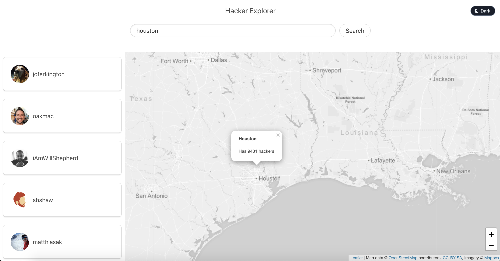
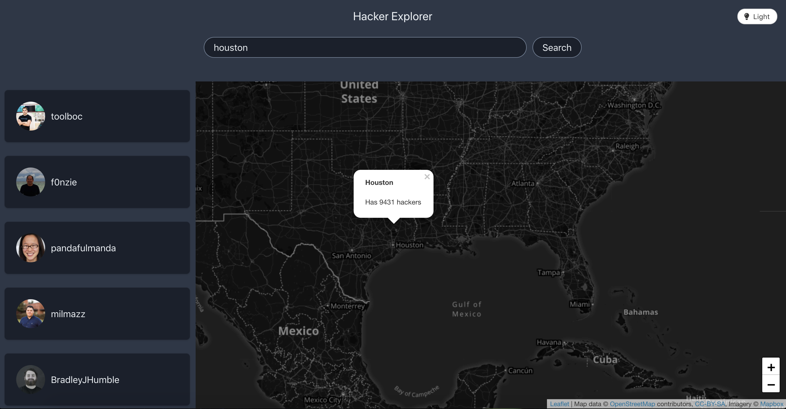

# Hacker Explorer
> Vanilla JavaScript app that searches for GitHub users close to your current location.


![Build Status][travis-image]

Tech utilized:
* [Leaflet](leaflet) for the map.
* [Bulma](bulma) CSS framework.
* [Jest](jest) for testing.
* [Travis](travis) for continuous integration.


## Light Theme


## Dark Theme


## Installation

OS X & Linux:

```sh
npm install
```

## Development setup

Run this command to start the development server.
The Parcel server will be running at http://localhost:1234

```sh
npm dev
```

## Runnning test

Run this command to start the Jest test.
Any file named <file-name>.test.js will be automatically picked up and added to the test suite.

```sh
npm test
```

## Contributing

1. Fork it (<https://github.com/yourname/yourproject/fork>)
2. Create your feature branch (`git checkout -b feature/fooBar`)
3. Commit your changes (`git commit -am 'Add some fooBar'`)
4. Push to the branch (`git push origin feature/fooBar`)
5. Create a new Pull Request

<!-- Markdown link & img dfn's -->
[travis-image]: https://travis-ci.org/pablo-jurado/hacker-explorer.svg?branch=master
[travis]: https://enterprise.travis-ci.com/
[leaflet]: https://leafletjs.com/
[jest]: https://jestjs.io
[bulma]: https://bulma.io/

